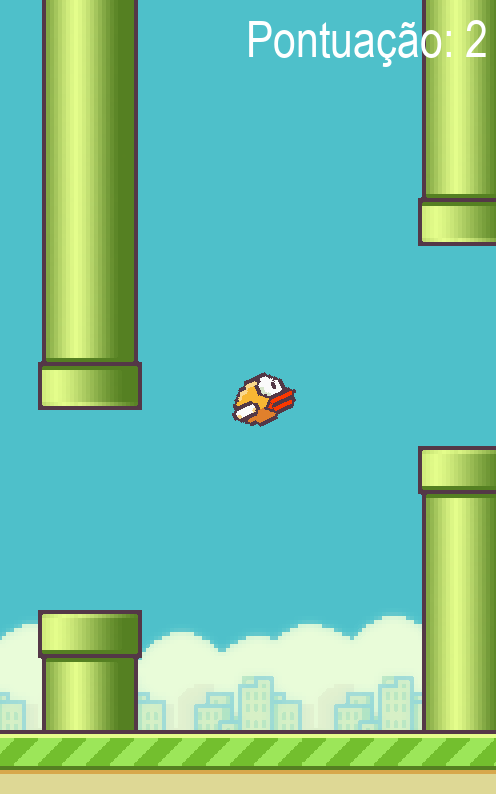
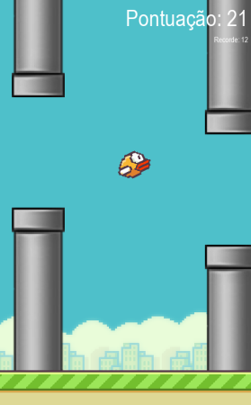

# How FlappyBird Works

Flappy Bird is a popular casual electronic game where the player controls a small bird challenged to fly through pipes without colliding. The objective is to advance as far as possible to achieve the highest score. To play on the computer, you can press the space key to make the bird fly and release the key to make it descend. Precision in the timing of jumps is crucial to avoid obstacles and progress in the game. The simplicity of Flappy Bird makes it addictive and challenging for players of all ages.

# Getting Started
It's simple! Follow these steps:

1. Clone this repository to your computer.
2. Install pygame using the command 'pip install pygame' if you haven't already.
3. Run the 'FlappyBird.py' script.
4. Start playing!

# How the Code Was Created
I started by following the step-by-step of the Hashtag's course on how to create Flappy Bird. The tutorial videos can be found at this link: [Flappy Bird Tutorial](https://pages.hashtagtreinamentos.com/minicurso-python-criacaojogos-obrigado?blog=1n4033rer&video=3dep762tr). The solution (final result) for those videos is in the 'FlappyBird_gabarito.py' file if you want to test it.

However, I found the game incomplete and boring, so I decided to add some changes and new features. So here is a list of the changes I made to the FlappyBird game:
- Increased the distance between the top pipe and the bottom pipe from 200 to 217 pixels.
- The game no longer automatically closes when you lose (or continues running even after losing); now it displays a game over screen, and you can press ENTER if you want to continue playing.
- Added a basic record system; your record is displayed in the top right corner and also on the game over screen.
- Added Bob Sponge and DETEU as playable characters.
- Created a mini interface to choose your character before starting the game.
- Implemented a system where every 20 pipes, a new pipe color starts to appear (the last new color unlocked after reaching 80 points).

# Game Over Screen and Record
I added a game over screen so that the player doesn't need to run the code again every time they die; just press the ENTER key, and the game restarts. Additionally, a record system was implemented to make the game more interesting. Your record will be saved on your computer, so don't worry about it. If you want to reset your record, simply go to the 'recorde.txt' file and change the number there to zero.

# New Playable Characters

Right at the beginning of the game, you'll have the chance to choose which character you want to play with. Just press the '1', '2', or '3' key on your computer to select the desired character.

Here are the character descriptions:

| Character | Number | Width | Height | Description |
| -- | -- | -- | -- | -- |
| Bird | 1 | 34 | 24 | If you just want to play the game normally, this is the perfect choice for you. |
| Bob Sponge | 2 | 34 | 24 | Fun choice, although its movement is a bit strange, which may interfere with the gameplay. |
| DETEU | 3 | 34 | *60* | (Challenge) Playing with DETEU is a challenge due to its considerably larger hitbox than the others. |

# Colorful Pipes

If you manage to advance in the game, the pipes change colors! As you can see in the image below, one of the existing colors is silver, but I won't spoil the other colors for you. You can discover them by playing the game or opening the game files (if you're competent).

0-20: Green

20-40: ???

40-60: ???

60-80: ???

80-∞: ???

In addition to the green color, we have four other different colors to be discovered; you just have to reach the 80-point mark to see all of them.

Objective: Reach 80 points to see all possible colors.

(Challenge) Reach pipe 80 using DETEU.

Good luck!

# Future Changes
* The code has a problem: pipes 20, 40, 60, and 80 change color instantly when you pass through them. The idea is to keep these pipes the same and only change the color for the subsequent pipes.
* The code is still quite messy, and I believe there are some things that can be adjusted, such as adding comments within the functions.

Feel free to play around with the code, and if you want to help, send a PR, and I'll review it as soon as possible.
